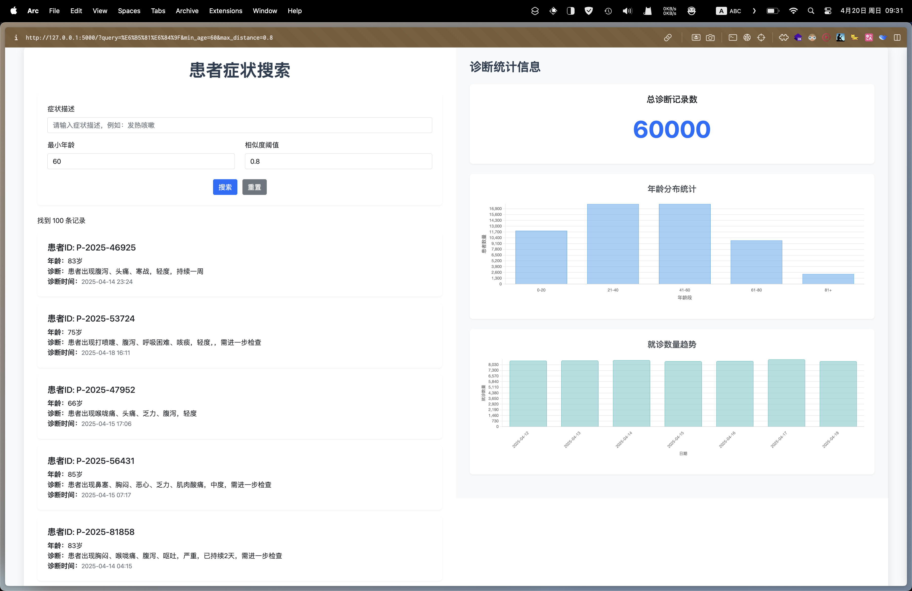
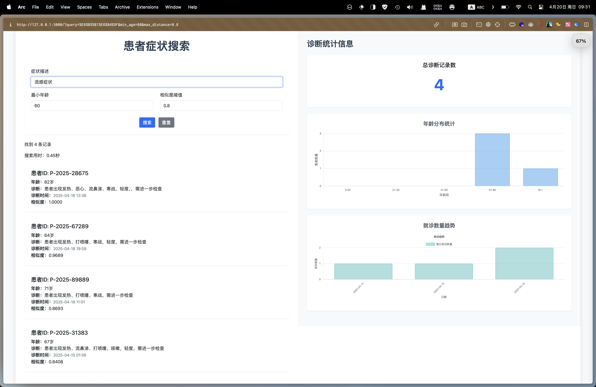
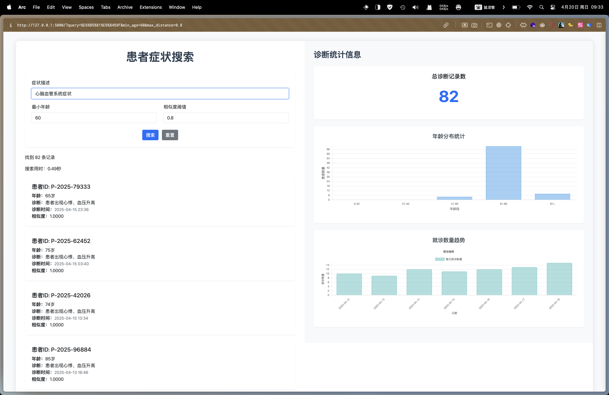
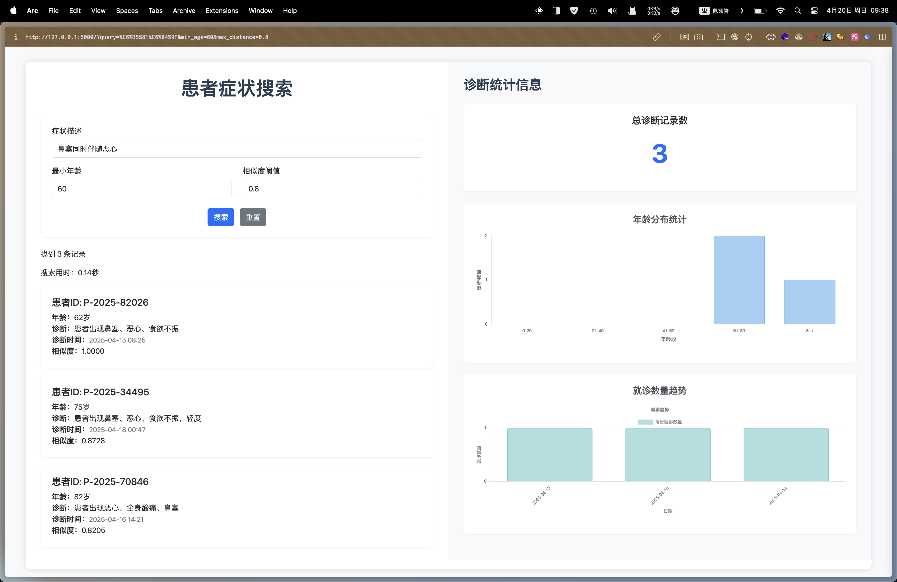
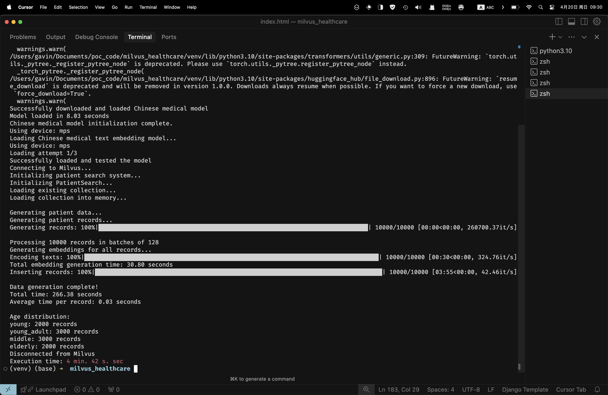

# 医疗病例智能检索系统

基于 Milvus 向量数据库和中文文本向量化模型构建的医疗病例智能检索系统，支持通过症状描述快速检索相似病例。

## 功能特点

- 支持中文症状描述的语义搜索
- 基于年龄的智能过滤
- 实时病例统计和可视化
- 年龄分布和诊断趋势分析
- 批量病例数据生成
- 高性能向量检索

### screenshots












## 技术栈

- 后端：Python, Flask
- 数据库：Milvus
- 向量模型：sentence-transformers
- 前端：HTML, JavaScript, Chart.js
- 环境管理：python-dotenv

## 系统要求

- Python 3.8+
- Milvus 2.0+
- 至少 8GB RAM
- 支持 CUDA 的 GPU（可选，用于加速模型推理）

## 部署步骤

### 1. 安装 Milvus

```bash
# 使用 Docker 安装 Milvus
docker-compose up -d
```

### 2. 克隆项目

```bash
git clone https://github.com/wwfalcon/milvus_healthcare.git
cd milvus_healthcare
```

### 3. 安装依赖

```bash
pip install -r requirements.txt
```

### 4. 配置环境变量

```bash
# 复制环境变量模板
cp .env_sample .env

# 编辑 .env 文件，设置你的配置
vim .env
```

### 5. 初始化数据

```bash
# 生成测试数据
python generate_data.py
```

### 6. 启动服务

```bash
# 启动 Web 服务
python app.py
```

## 环境变量配置

在 `.env` 文件中配置以下参数：

- `MILVUS_HOST`: Milvus 服务器地址
- `MILVUS_PORT`: Milvus 服务器端口
- `MODEL_NAME`: 文本向量化模型名称
- `TOTAL_CASES`: 要生成的病例总数
- `BATCH_SIZE`: 批量处理大小
- `AGE_GROUP_DISTRIBUTION`: 年龄组分布
- `DEFAULT_MIN_AGE`: 默认最小年龄
- `DEFAULT_MAX_DISTANCE`: 最大距离阈值
- `SEARCH_LIMIT`: 搜索结果限制
- `NPROBE`: 搜索范围参数

## 使用说明

### 1. 数据生成

```bash
python generate_data.py
```

此命令将：
- 连接 Milvus 数据库
- 初始化文本向量化模型
- 生成指定数量的病例数据
- 将数据插入到 Milvus 中

### 2. 病例搜索

```bash
python patient_search.py "症状描述" [最小年龄] [最小相似度]
```

示例：
```bash
python patient_search.py "发热咳嗽" 60 0.8
```

### 3. Web 界面

访问 `http://localhost:5000` 使用 Web 界面：
- 输入症状描述进行搜索
- 查看搜索结果和统计信息
- 分析年龄分布和诊断趋势

## 项目结构

```
milvus_healthcare/
├── app.py              # Web 服务主程序
├── generate_data.py    # 数据生成脚本
├── patient_search.py   # 病例搜索模块
├── requirements.txt    # 依赖包列表
├── .env_sample        # 环境变量模板
├── .env               # 环境变量配置
├── static/            # 静态资源
│   └── css/
│       └── style.css  # 样式文件
└── templates/         # HTML 模板
    └── index.html     # 主页面模板
```

## 性能优化

- 使用批量处理减少数据库操作
- 实现多进程并行处理
- 优化向量搜索参数
- 使用 GPU 加速模型推理

## 注意事项

1. 首次运行需要下载模型，可能需要较长时间
2. 确保 Milvus 服务正常运行
3. 根据实际硬件配置调整批处理大小
4. 定期备份数据库数据

## 贡献指南

1. Fork 项目
2. 创建特性分支
3. 提交更改
4. 推送到分支
5. 创建 Pull Request

## 许可证

MIT License

## 联系方式

- 作者：Gavin Wang
- 邮箱：wwfalcon@gmail.com
- 项目地址：https://github.com/wwfalcon/milvus_healthcare 